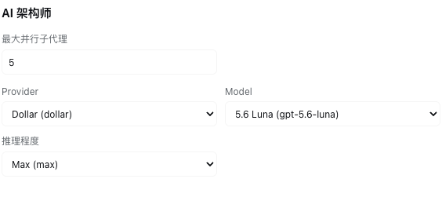

# @yangtianming314/dsh-architect

DSH AI 架构师编排插件，提供角色路由、硬工具权限、并发治理、项目记录和交付设置。



## 能力

- 按 developer、qa、release 角色限制可用工具和发布权限。
- 持久化任务依赖队列，依赖完成后自动调度后继任务。
- 以真实 Agent/session 活动更新停滞租约，避免把 idle 误判为完成。
- 管理项目估时、阶段耗时、发布后回归和 worktree 收尾证据。
- 在设置页调整并发数、Provider、模型和推理程度。
- 与工作树工具通过工具契约协作，不直接复制或依赖另一插件的源码。

## 安装

```sh
dsh plugin --profile web add @yangtianming314/dsh-architect@latest
```

安装后在 DSH 设置中打开“AI 架构师”。首次安装新 client 包时按当前 DSH 版本提示重新加载 profile。

## 开发

```sh
npm test
```

`dsh-architect` 会在运行时调用 DSH 工具层中的 `wt_*` 能力；如果没有安装工作树插件，相关自动收尾动作会报告工具不可用，而不会导入另一插件的代码。

## 兼容性

- Node.js >= 20
- DSH 0.1.0-rc.6 及以上
- React 18
- DSH 的 Cordis、Tools、Settings、LLM、Typert 和 Schemastery 作为 peer dependency 提供

## 许可证

MIT
